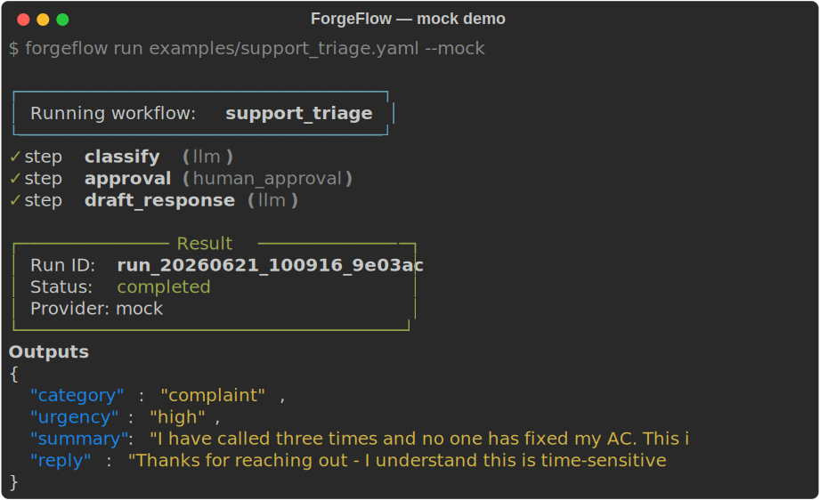
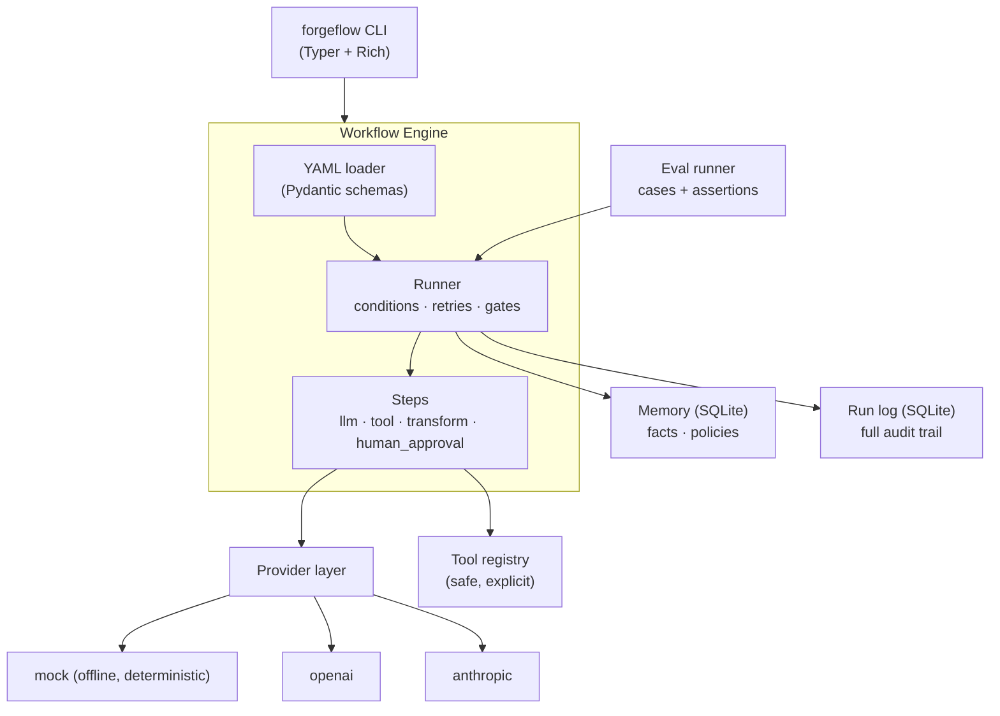

<div align="center">

# 🔨 ForgeFlow

### The missing workflow layer for practical AI automation.

**Turn prompt chains into tested, observable, human-gated workflows — without duct-taping prompts, scripts, and Zapier flows together.**

[](https://github.com/your-org/forgeflow/actions/workflows/ci.yml)
[](https://www.python.org/downloads/)
[](LICENSE)
[](docs/providers.md)
[](CONTRIBUTING.md)

</div>

---

## What is this?

ForgeFlow is a small, local-first engine that runs **AI workflows defined in YAML**. Each workflow is a sequence of steps — LLM calls, tool calls, transforms, and **human-approval gates** — with structured outputs, retries, an audit log of every run, and an **eval system** so you can prove your workflow still works before you ship it.

It runs **fully offline in mock mode** (no API keys), so you can clone it and see a real workflow execute in under 60 seconds. Swap in OpenAI or Anthropic with one flag when you're ready.

```bash
forgeflow run examples/support_triage.yaml --mock
```

<div align="center">
  
</div>

> _Real terminal output, generated offline by the mock provider — zero API keys.
> Regenerate with `python scripts/gen_demo_svg.py`._

---

## The problem

Everyone is shipping AI features the same way: a prompt in a Python script, a JSON parser bolted on, a `print()` for logging, a Slack message for approvals, and absolutely no tests. It works in the demo and breaks in production — silently.

The gap isn't a lack of frameworks. It's the lack of a **thin, boring layer** that gives prompt chains the things normal software has:

| You have | You're missing |
| --- | --- |
| Prompts that work *sometimes* | Repeatability and version control |
| `json.loads()` wrapped in try/except | Structured outputs with retries |
| A script that runs end-to-end | A gate before it emails the customer |
| "It worked when I tried it" | Evals that catch regressions |
| `print()` statements | An audit log you can inspect later |

ForgeFlow is that layer. It's the bridge between *prototype* and *production*.

---

## Quickstart (5 minutes)

```bash
# 1. Install (no API keys needed for mock mode)
pip install -e .

# 2. Run a real workflow, fully offline
forgeflow run examples/support_triage.yaml --mock

# 3. Prove it works with evals
forgeflow eval examples/evals/support_triage_eval.yaml

# 4. See your run history and inspect any run
forgeflow runs
forgeflow inspect <run_id>

# 5. Scaffold your own project
forgeflow init my-workflows
```

> Prefer real models? Copy `.env.example` to `.env`, add a key, and run without `--mock`
> (or pass `--provider openai` / `--provider anthropic`). See [docs/providers.md](docs/providers.md).

---

## A workflow is just YAML

```yaml
name: support_triage
description: Classify a customer message, gate urgent cases, draft a reply.

inputs:
  message: { type: string, required: true }

steps:
  - id: classify
    type: llm
    output: [category, urgency, summary]   # -> parsed as structured JSON
    prompt: |
      Read the message below and classify it.
      Message: {{ inputs.message }}

  - id: approval
    type: human_approval                    # <- a human gate, only when it matters
    when: "{{ steps.classify.output.urgency == 'high' }}"
    message: "High-urgency issue. Approve before replying."

  - id: draft_response
    type: llm
    prompt: "Write a professional reply based on: {{ steps.classify.output }}"

outputs:
  reply: "{{ steps.draft_response.output }}"
```

That's the whole mental model: **steps that pass data forward via `{{ templates }}`, with conditions and human gates where you need them.** Full spec in [docs/workflow-spec.md](docs/workflow-spec.md).

---

## Dashboard

Prefer a UI to the terminal? `forgeflow serve` launches a local, zero-dependency
web dashboard (stdlib only — nothing to install) for browsing runs and memory:

```bash
forgeflow serve        # http://127.0.0.1:8787
```

It auto-refreshes, lets you click any run to see its full step-by-step trace, and
reads from the same local store the CLI writes to. It's read-only and stays on your
machine. Full details + JSON API in [docs/dashboard.md](docs/dashboard.md).

## Architecture



| Layer | What it does |
| --- | --- |
| **Engine** | Loads YAML, runs steps in order, evaluates `when` conditions, handles retries, halts on rejected approvals. |
| **Providers** | Pluggable LLM backends. `mock` is deterministic and offline; `openai` / `anthropic` are thin adapters. |
| **Tools** | An explicit registry of safe Python callables. **No shell, no eval** — you opt into your own tools. |
| **Memory** | Local SQLite key/value store for reusable facts and policies, readable from workflows. |
| **Run log** | Every run is persisted with inputs, per-step outputs, and status — inspectable forever. |
| **Evals** | Define test cases for a workflow and assert on any step output. Runs in CI in mock mode. |
| **Dashboard** | `forgeflow serve` — a stdlib-only local web UI over the run log and memory. |

---

## Features

- 📝 **Workflows as YAML** — readable, diff-able, version-controllable.
- 🧩 **Five step types** — `llm`, `tool`, `transform`, `human_approval`, and `map`.
- ⚡ **Parallel fan-out** — `map` runs a step over a list concurrently, order preserved.
- 🧱 **Structured outputs** — declare `output: [fields]` and get parsed JSON with auto-retry.
- 🔀 **Conditional steps** — `when:` expressions skip steps that don't apply.
- 🙋 **Human-in-the-loop** — approval gates that halt the run until a human says go.
- 🧪 **Evals** — test cases with rich assertions (`equals`, `contains`, `gte`, `not_empty`, …).
- 🗂️ **Audit log** — `forgeflow runs` and `forgeflow inspect <id>` for full traceability.
- 📊 **Local dashboard** — `forgeflow serve` opens a zero-dependency web UI for runs and memory.
- 🤖 **Scriptable** — `--json` on `run`/`eval`/`runs`/`inspect` for clean piping into CI and tools.
- 🧠 **Memory** — store policies and facts once, reuse them across workflows.
- 🔌 **Provider-agnostic** — mock / OpenAI / Anthropic, with a clean base class for more.
- 🖥️ **Offline demo mode** — the mock provider needs zero keys and is fully deterministic.
- 🎨 **A CLI that's nice to look at** — Rich tables, panels, and step-by-step output.

---

## CLI reference

| Command | Description |
| --- | --- |
| `forgeflow init [path]` | Scaffold a new project with a starter workflow + eval. |
| `forgeflow run <workflow.yaml> [--mock] [-i k=v] [-y] [--json]` | Run a workflow. |
| `forgeflow eval <eval.yaml> [--mock/--live] [--json]` | Run an eval suite and report pass/fail. |
| `forgeflow runs [-n N] [--json]` | List recent runs. |
| `forgeflow inspect <run_id> [--json]` | Show the full trace of a run. |
| `forgeflow serve [-p PORT] [--no-browser]` | Launch the local dashboard. |
| `forgeflow templates` | List built-in templates and registered tools. |
| `forgeflow memory set/get/list/delete` | Manage local key/value memory. |

---

## Example workflows

| Workflow | What it does |
| --- | --- |
| [`support_triage`](examples/support_triage.yaml) | Classify a customer message, gate urgent cases, draft a reply. |
| [`sales_lead_qualifier`](examples/sales_lead_qualifier.yaml) | Score a lead, recommend the next action, draft a follow-up. |
| [`meeting_notes_to_action_plan`](examples/meeting_notes_to_action_plan.yaml) | Turn rough notes into decisions, owners, and an action plan. |
| [`home_service_dispatch`](examples/home_service_dispatch.yaml) | Triage an HVAC/plumbing/electrical request into booking + tech notes. |
| [`bulk_triage`](examples/bulk_triage.yaml) | Classify a batch of messages **in parallel** with a `map` step. |

---

## FAQ

<details>
<summary><b>Why not just LangChain / LlamaIndex?</b></summary>

Those are SDKs for *building* LLM apps in Python. ForgeFlow is a level up: your workflow is a **declarative YAML artifact** that's tested, logged, and gated by default. There's no chain-of-objects to wire up, and the whole thing runs offline so you can iterate without burning tokens. You can absolutely call ForgeFlow *from* a larger app — they're complementary.
</details>

<details>
<summary><b>Why not just n8n / Zapier / Make?</b></summary>

Those are great for SaaS-to-SaaS plumbing, but they treat the LLM as one more black-box node — no structured-output contracts, no evals, no version-controlled prompts, and approvals that live in someone's inbox. ForgeFlow is **code-first and AI-native**: workflows live in your repo, run in CI, and have first-class evals and human gates.
</details>

<details>
<summary><b>Why not just write a Python script?</b></summary>

You can — until you have ten of them, each with its own JSON parser, its own logging, its own "did this break?" anxiety. ForgeFlow gives every workflow the same structured outputs, retries, audit log, and tests for free, so the tenth workflow is as boring and reliable as the first.
</details>

<details>
<summary><b>Is it safe? Does it run arbitrary code?</b></summary>

No. ForgeFlow ships **no shell tool and no eval tool**. Tools are an explicit registry of Python callables you opt into. High-impact actions belong behind `human_approval` gates, and every run is logged for inspection. See [Safety](#safety).
</details>

<details>
<summary><b>Do I need an API key to try it?</b></summary>

No. The `mock` provider is deterministic and offline — every example and the entire eval suite run with zero keys. Add a key only when you want real model output.
</details>

---

## Safety

ForgeFlow is built for **controlled** automation, not blind autonomy:

- **Human approval gates** (`human_approval`) halt the run before high-impact actions.
- **No arbitrary execution** — no built-in shell or `eval`; tools are explicit and opt-in.
- **Everything is logged** — inputs, per-step outputs, and status are persisted and inspectable.
- **Test before you ship** — evals let you catch regressions in CI, in mock mode.
- **Keys stay local** — provider keys come from your environment / `.env`, never from workflow files.

---

## Roadmap

- [x] Parallel `map` / fan-out step
- [x] `--json` output for scripting
- [x] Local web dashboard for runs & memory (`forgeflow serve`)
- [ ] Web-based approvals (approve/reject gates from the dashboard)
- [ ] Visual workflow builder
- [ ] Vector memory + retrieval step
- [ ] More providers (local models via Ollama, Google, Mistral)
- [ ] Team approvals (Slack / email gates)
- [ ] Built-in tool packs (Gmail, Calendar, HTTP)
- [ ] Hosted run API + workflow marketplace
- [ ] Richer eval types (LLM-as-judge, semantic similarity)

Want one of these? Open an issue or grab a [good first issue](CONTRIBUTING.md#good-first-issues).

---

## Contributing

PRs welcome! New providers, tools, example workflows, and eval types are especially valuable.
See [CONTRIBUTING.md](CONTRIBUTING.md) and the [`docs/`](docs/) folder.

```bash
pip install -e ".[dev]"
pytest          # run the suite
ruff check .    # lint
```

## License

[MIT](LICENSE) — use it, fork it, ship it.
