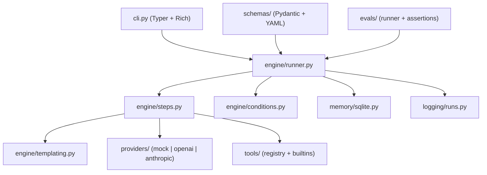

# Architecture

ForgeFlow is intentionally small. The whole thing is a YAML loader, a step loop,
a provider abstraction, and two SQLite tables. No magic.

## The run loop

`run_workflow()` ([runner.py](../src/forgeflow/engine/runner.py)) is the heart:

1. Resolve inputs (merge `example_inputs`, CLI `--input`, and `default`s; validate `required`).
2. Build a context: `{ inputs, steps, memory }`.
3. For each step:
   - Evaluate `when` — skip if falsy.
   - Dispatch by `type`:
     - `human_approval` → call the `approver` callback; halt if rejected.
     - `llm` / `tool` / `transform` → execute, with retry on JSON parse failure for `llm`.
     - `map` → fan out an inner step over a list concurrently (`ThreadPoolExecutor`), order preserved.
   - Record the `StepResult` and expose `steps.<id>.output` to later steps.
4. Render `outputs` from the final context.
5. Persist the whole `RunResult` to SQLite (unless `store=False`).

Errors in a step are caught, recorded with status `error`, and stop the run — so a
failure is always *inspectable* rather than a stack trace in a log somewhere.

## Why these boundaries

- **Providers** are behind a one-method interface (`complete`) so adding a backend is ~30 lines.
- **Tools** are a registry of plain callables — explicit and safe by construction.
- **Storage** is a single local SQLite file (`./.forgeflow/forgeflow.db`), so there's nothing to host to get full audit logs and memory.
- **Evals** reuse the exact same `run_workflow()`, so what you test is what you run.

## Extending

- **New provider:** subclass `Provider` in `providers/`, register it in `providers/__init__.py`.
- **New tool:** `default_registry.register("name", fn, "desc")` or use the `@registry.tool(...)` decorator.
- **New step type:** add a branch in `engine/runner.py::_execute` and an executor in `engine/steps.py`.
